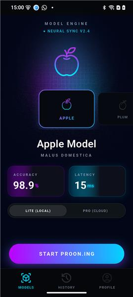
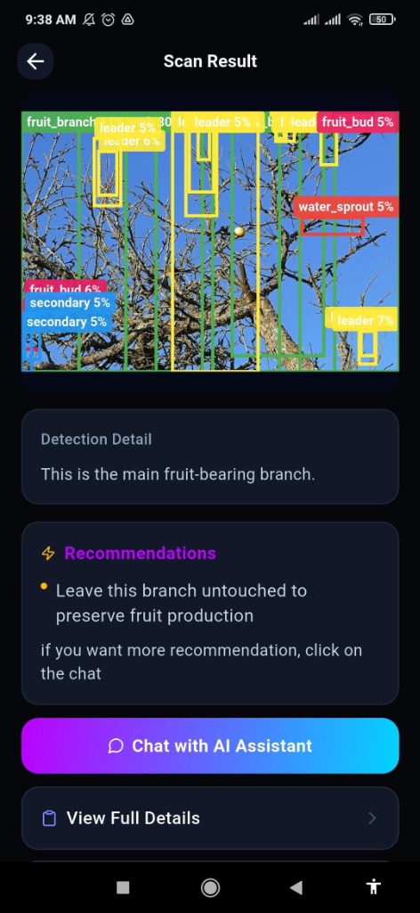
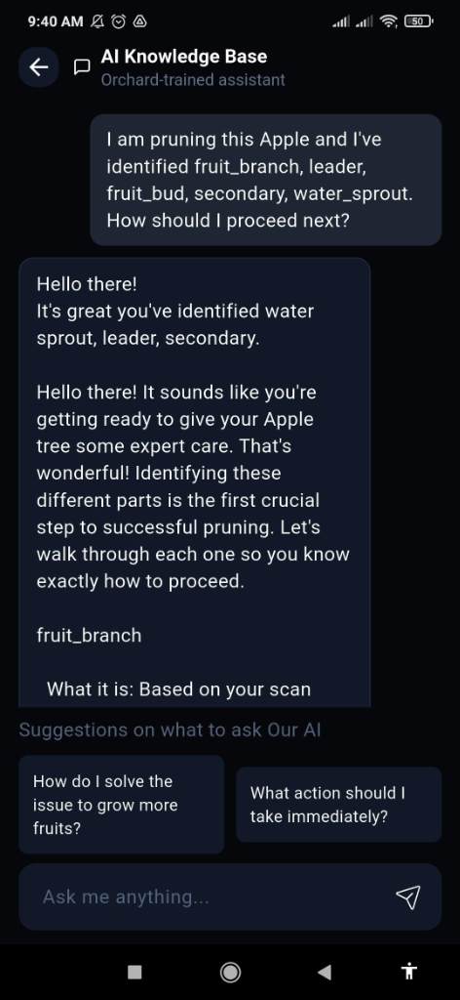

<div align="center">
  <h1>🌳 Proon AI Backend Core</h1>
  <p><strong>Next-Generation Agricultural Vision & AI Pruning Assistant</strong></p>
  
  [](https://www.djangoproject.com/)
  [](https://www.django-rest-framework.org/)
  [](https://deepmind.google/technologies/gemini/)
  [](https://www.tensorflow.org/lite)
  [](https://www.postgresql.org/)
</div>

---

## 📖 Overview
**Proon AI** is a production-grade, AI-first backend engineered to power a mobile application dedicated to precision agriculture and orchard management. It bridges the gap between **Edge Computing (On-Device ML)** and **Cloud AI (Large Multimodal Models)** to provide real-time plant detection, ripeness analysis, and expert pruning guidance.

Designed with scalability and AI-integration at its core, this architecture demonstrates how to successfully deploy RAG (Retrieval-Augmented Generation) concepts in a highly specialized, vision-driven domain.

## 📸 App Showcase

<div align="center">
  
  
  
  <br>
  <p><em>From left to right: OTA Model Selection, Advanced Vision Detection, Context-Aware RAG Chatbot.</em></p>
</div>
<br>

*(Note: Please ensure the images provided are placed in an `assets/` folder in the root of the repository with the names: `models_screen.png`, `scan_result.png`, and `chat_assistant.png`)*

---

## 🧠 AI & Machine Learning Architecture

This backend doesn't just call APIs; it orchestrates a complex, dual-mode AI pipeline.

### 1. Hybrid Vision Engine (Edge + Cloud)
- **Lite Mode (Edge AI):** Supports offline, zero-latency inference using **TensorFlow Lite**. The backend manages a robust rule-engine that maps edge-detected classifications to comprehensive botanical data (ripeness scores, peak harvesting windows, and rapid pruning tips).
- **Pro Mode (Cloud Vision):** Integrates directly with **Google Gemini 2.5 Flash Vision**. The backend handles image downscaling, Exif correction, and base64 transmission, injecting precise system prompts to enforce strict, predictable JSON outputs for complex, multi-object orchard scenes.

### 2. Context-Aware RAG Chatbot
- **Dynamic Context Injection:** When a user asks a question, the backend seamlessly retrieves the active `ScanHistory` and dynamically constructs a rich system prompt containing highly specific horticultural knowledge (e.g., how to treat a *Water Sprout* vs. a *Central Leader*).
- **Multi-Label Parsing:** Actively parses user input to identify multiple detected objects, injecting bespoke pruning knowledge for every single identified branch type in real-time.
- **Memory & Session Management:** Built a robust conversational memory architecture (`ChatSession` and `ChatMessage` models) to maintain multi-turn dialogue context over REST.

### 3. OTA (Over-The-Air) Model Delivery System
- Engineered a custom **TFLite Model Registry**. Administrators can upload new neural network weights (`.tflite`) and label maps directly via the Django admin panel.
- Mobile clients dynamically pull the latest models via versioned endpoints (`/api/model/version/`), ensuring users always have the smartest edge-AI without requiring App Store updates.

---

## 🛠️ Technical Highlights (For Engineering Teams)

- **Decoupled Architecture:** Clean separation of concerns across dedicated Django apps (`api/`, `authapp/`, `adminapp/`), adhering to SOLID principles.
- **Advanced Auth & Security:** Implements stateless **JWT (JSON Web Tokens)** alongside full OAuth2 Social Authentication (Google/Facebook) via `dj-rest-auth` and `django-allauth`.
- **Fault-Tolerant AI Services:** The `gemini_service.py` implements intelligent retry mechanisms, model fallbacks (automatically degrading from `gemini-2.5-flash` to `2.0` on quota exhaustion), and graceful error handling.
- **Optimized Media Handling:** Custom image preprocessing pipeline built with `Pillow` that resizes, strips EXIF data, and recompresses uploads on-the-fly to minimize cloud ingress costs and latency.
- **Relational Data Integrity:** A highly normalized PostgreSQL schema linking Users, Plant Categories, Detection Rules, Scan Histories, and Chat Sessions with appropriate indexing for fast retrieval.

---

## 📂 Project Structure

```bash
📦 proon_ai_backend
 ┣ 📂 api/               # Core AI engine: Gemini integration, TFLite registry, Chat logic
 ┣ 📂 authapp/           # Security: JWT generation, OTP, OAuth integrations
 ┣ 📂 adminapp/          # Operations: Custom admin dashboards for ML model management
 ┣ 📂 proon_ai_backend/  # Config: Main Django settings, WSGI/ASGI entry points
 ┗ 📜 manage.py          # Django CLI
```

---

## 🚀 Quick Start

### Prerequisites
- Python 3.10+
- PostgreSQL (Production) or SQLite (Local Dev)
- Google Gemini API Key

### Installation

1. **Clone & Setup Environment**
   ```bash
   git clone <repository-url>
   cd proon_ai_backend
   python -m venv venv
   source venv/bin/activate  # On Windows: venv\Scripts\activate
   pip install -r requirements.txt
   ```

2. **Configure Variables (`.env`)**
   ```env
   DEBUG=True
   ENVIRONMENT=local
   DJANGO_SECRET_KEY=your_super_secret_key
   GEMINI_API_KEY=your_gemini_api_key
   ```

3. **Initialize Database & Run**
   ```bash
   python manage.py migrate
   python manage.py createsuperuser
   python manage.py runserver
   ```

---
<div align="center">
  <i>Developed with ❤️ for intelligent agriculture. Bridging the gap between code and canopy.</i>
</div>
